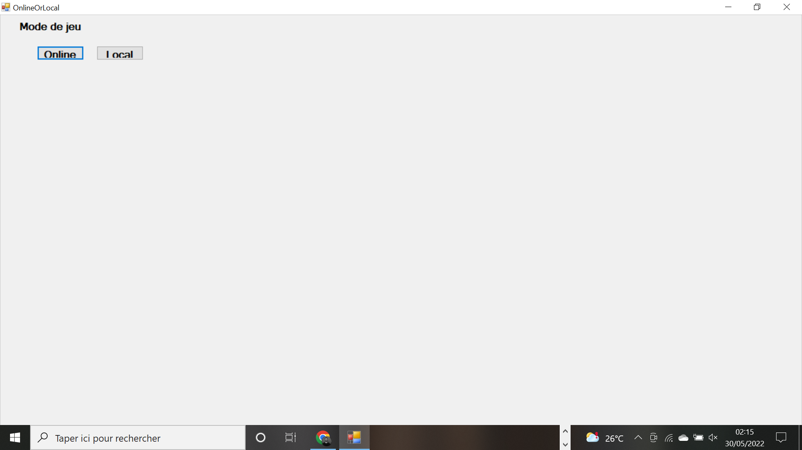
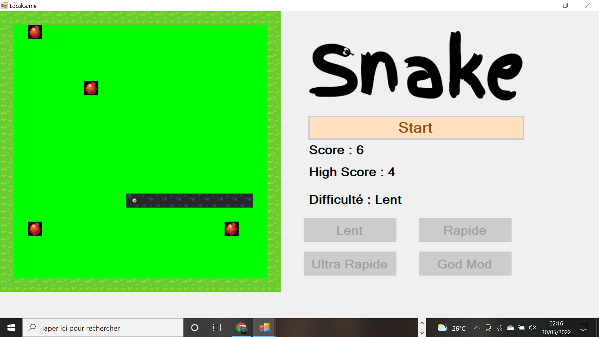
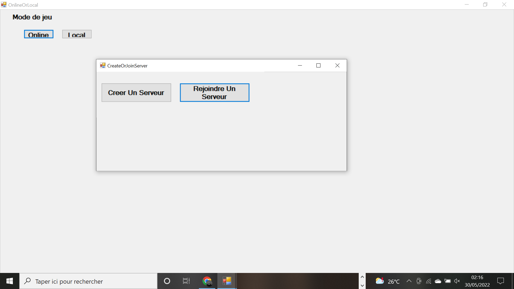
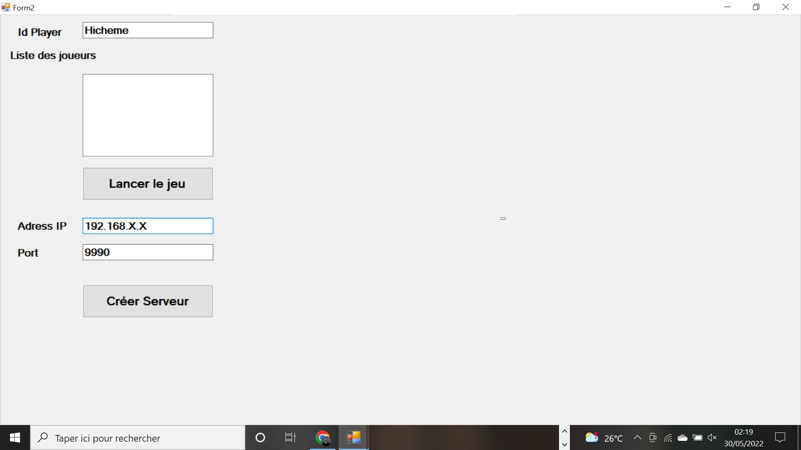
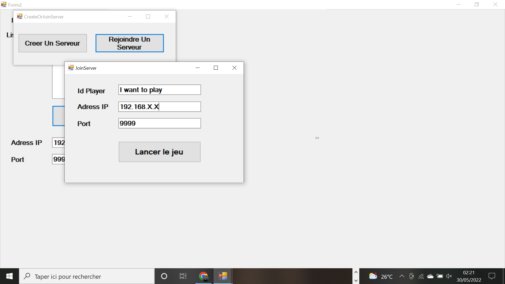
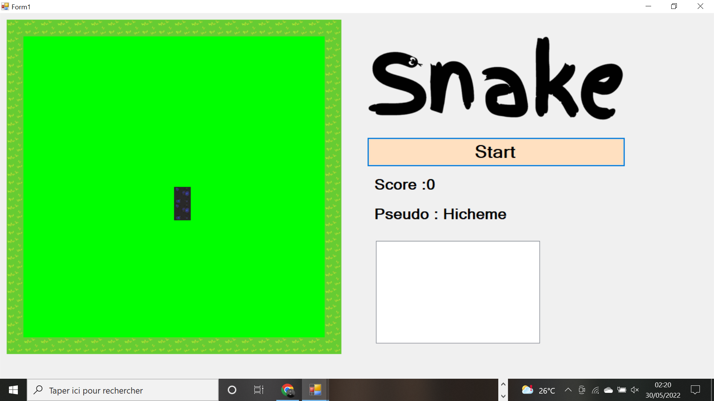

# SnakeGame
Projet Snake - C# Windows Form.
BEN GAIED Hicheme

## Jouer Solo

Vous pouvez jouer en solo en choisissant le mode de jeu **"Local"**

Une nouvelle page va s'ouvrir, vous pouvez également sélectionner la difficulté du jeu en choisissant la vitesse. Pour lancer le jeu il suiffit de cliquer sur **"Start"**.

## Créer ou rejoindre un serveur

**IMPORTANT - Vous devez être sur le même wifi**

Le joueur aura le choix entre créer son serveur pour inviter des amis ou bien rejoindre des amis.

## Création d'un serveur

Vous devez créer un serveur avec une adresse Ip et un Port et votre nom d'utilisateur ensuite cliquer sur **"Créer Serveur** et après sur **"Lancer le jeu"**  !

Ensuite vous devez les communiquer aux personnes avec qui vous voulez jouer.

## Rejoindre un serveur

Pour rejoindre un serveur il faut l'adresse Ip et un Port de ce serveur et votre nom d'utilisateur  et puis cliquer sur **"Lancer le jeu **!

## Début du jeu !

Le jeu ce lance quand les joueurs seront tous prêt, pour cela ils fout que les joueurs cliquent tous sur le bouton **"Start"**

Le jeu se termine quand il ne reste plus aucun joueur en vie.
Il y aura un système de classement à la fin de la partie. Le gagnant sera celui qui sera resté en vie le plus longtemps.

## Comment jouer 

* Z - Vers le haut
* Q - Tourner à gauche
* D - Tourner à droite
* S - Vers le bas
